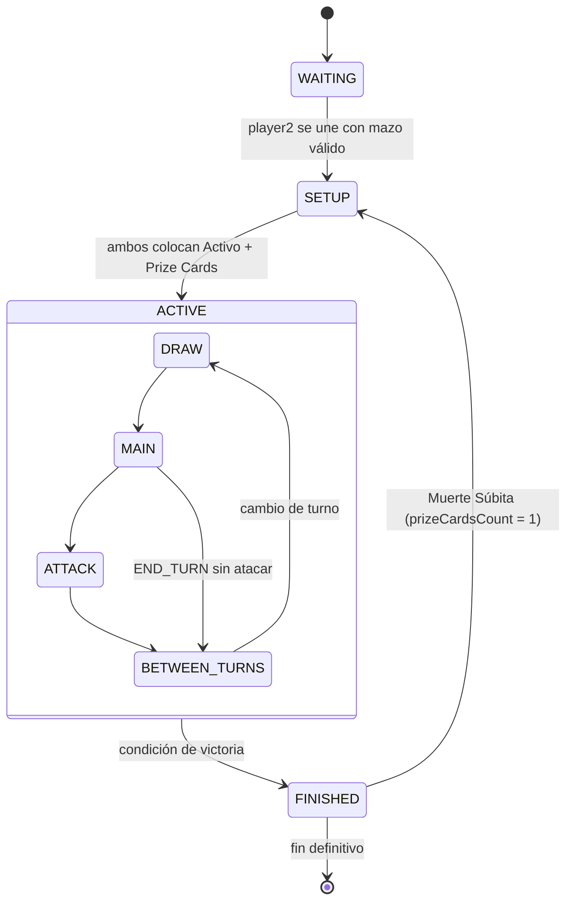

# ENGINE_SPEC — Motor de juego

Especificación completa del `GameEngine` — reglas XY1, setup, turnos, ataque, condiciones especiales.
El engine es Java puro: sin Spring, sin BD, sin efectos secundarios.

---

## Principio fundamental

```
GameService (@Transactional, Spring) 
  → carga GameState de BD 
  → deserializa stateJson a BoardState (Jackson) 
  → GameEngineFacade.processAction(request, boardState) 
  → retorna (BoardState nuevo, List<GameEvent>) 
  → GameService serializa BoardState y guarda en BD 
  → publica eventos con ApplicationEventPublisher
```

El engine recibe un estado, aplica reglas, devuelve el estado modificado y los eventos. No sabe que existe una base de datos.

---

## Diagrama de estados



### Transiciones de GameStatus

| Desde | Hacia | Condición |
|-------|-------|-----------|
| `WAITING` | `SETUP` | Player2 se une con mazo válido |
| `SETUP` | `ACTIVE` | Ambos jugadores colocaron Activo y Prize Cards |
| `ACTIVE` | `FINISHED` | Cualquier condición de victoria |
| `FINISHED` | `SETUP` | Muerte Súbita — `prizeCardsCount = 1` |

---

## Setup (fase SETUP)

### Parámetros iniciales

| Parámetro | Valor |
|-----------|-------|
| Mazo | 60 cartas (set XY1) |
| Mano inicial | 7 cartas |
| Prize Cards por jugador | 6 (partida normal) / 1 (Muerte Súbita) |
| Espacios de Banca | Máximo 5 |

### Secuencia

1. Cada jugador baraja su mazo con `SecureRandom`.
2. Cada jugador roba 7 cartas.
3. **Validación de mano — Mulligan**:

   a. Si la mano del jugador NO contiene ningún Pokémon con subtipo `Basic`:
      - Incrementar `mulliganCount[jugador]` en 1.
      - La mano se revela al oponente (visible para auditoría).
      - El jugador devuelve las 7 cartas al mazo, baraja y roba 7 nuevas.
      - Repetir desde paso 3a.

   b. Si la mano contiene al menos 1 Pokémon Básico: continuar.

4. **Compensación por Mulligan** (aplicar cuando ambos tienen mano válida):
   - El oponente de quien hizo Mulligan puede robar `N` cartas adicionales, donde `N = mulliganCount[rival]`.
   - El oponente puede optar por robar menos de `N` o ninguna (es su elección).
   - **Mulligans simultáneos**: si ambos hicieron Mulligan, se restan entre sí. Si jugador A tiene `mulliganCount=3` y jugador B tiene `mulliganCount=2`, solo jugador B puede robar 1 carta adicional (la diferencia).

5. **Colocación**:
   - Cada jugador DEBE seleccionar 1 Pokémon Básico de su mano y asignarlo como Pokémon Activo.
   - Cada jugador PUEDE seleccionar hasta 5 Pokémon Básicos adicionales de su mano y colocarlos en la Banca.

6. **Prize Cards**:
   - El sistema mueve automáticamente las primeras `prizeCardsCount` cartas del tope del mazo a la zona Prize (boca abajo).

7. **Determinación del primer jugador**:
   - El sistema lanza una moneda (coin flip).
   - El **ganador del flip elige quién empieza** — no se asigna automáticamente.
   - El perdedor del flip no puede elegir.

8. **The Reveal**: todos los Pokémon en zonas Activo y Banca pasan de estado `FaceDown` a `FaceUp`.

9. Transición: `SETUP → ACTIVE`. El jugador elegido inicia en fase `DRAW`.

### Regla del primer turno

El jugador que inicia la partida:
- **Puede robar** en su fase DRAW (excepto si el reglamento variante lo prohibe — en XY1 estándar sí roba).
- **No puede atacar** en su primer turno (`firstPlayerHasActed = false` → `CANNOT_ATTACK_FIRST_TURN`).
- **No puede evolucionar** en su primer turno de la partida.

`firstPlayerHasActed` se establece en `true` al finalizar el primer turno del jugador inicial.

---

## Turno activo — fases

### DRAW

1. El jugador activo roba 1 carta de su mazo.
2. Si el mazo está vacío al intentar robar → **derrota del jugador activo** (ver Condiciones de victoria).
3. Reiniciar `TurnFlags` del jugador activo.
4. Transición automática a `MAIN`.

### MAIN

El jugador puede realizar **en cualquier orden**, respetando los límites:

| Acción | ActionType | Límite por turno | Condición adicional |
|--------|-----------|-----------------|---------------------|
| Jugar Pokémon Básico en Banca | `PLAY_BASIC_POKEMON` | Sin límite | Banca no llena (máx. 5) |
| Evolucionar un Pokémon | `EVOLVE_POKEMON` | Sin límite | El Pokémon objetivo debe llevar ≥ 1 turno en juego; prohibido en el primer turno de la partida |
| Adjuntar energía | `ATTACH_ENERGY` | **1 por turno** | Desde la mano; al Activo o Banca |
| Jugar ITEM | `PLAY_ITEM` | Sin límite | — |
| Jugar SUPPORTER o AS TÁCTICO | `PLAY_SUPPORTER` | **1 por turno** | Límite compartido |
| Jugar STADIUM | `PLAY_STADIUM` | 1 por turno | Reemplaza el Estadio anterior en juego |
| Adjuntar POKEMON_TOOL | `ATTACH_TOOL` | 1 por Pokémon | Un Pokémon no puede tener más de 1 herramienta |
| Retirarse | `RETREAT` | **1 por turno** | Pagar costo de retiro en energías; Banca no vacía |

Salidas de la fase MAIN:
- Jugador declara ataque → transición a `ATTACK`.
- Jugador envía `END_TURN` → transición directa a `BETWEEN_TURNS`.

### ATTACK

1. El jugador declara qué ataque del Pokémon Activo ejecuta (índice del ataque).
2. Se ejecuta el **pipeline de resolución de ataque** (ver sección siguiente).
3. Transición automática a `BETWEEN_TURNS`.

### BETWEEN_TURNS

Orden de resolución fijo (el sistema ejecuta estos pasos, no el jugador):

1. Aplicar daño de `POISONED`: 10 de daño al Pokémon Activo del jugador afectado.
2. Aplicar daño de `BURNED`: 20 de daño al Pokémon Activo afectado + flip de moneda (cara → se cura el BURNED).
3. Resolver `ASLEEP`: flip de moneda para el Pokémon Activo dormido (cara → despierta).
4. Resolver `PARALYZED`: se cura automáticamente.
5. Verificar condiciones de victoria.
6. Si la partida continúa:
   - Cambiar jugador activo.
   - Reiniciar `TurnFlags` del nuevo jugador activo.
   - Transición a `DRAW`.

---

## Pipeline de resolución de ataque (Chain of Responsibility)

Cada `AttackHandler` recibe un `AttackContext` y puede lanzar `InvalidActionException` para detener la cadena.

```
AttackContext {
  ActivePokemon   attacker
  ActivePokemon   defender         // puede ser el Activo del oponente o de la Banca (si el ataque permite)
  Attack          declaredAttack
  BoardState      boardState
  int             damageModifiers  // acumulador de modificadores de daño (positivo y negativo)
  List<GameEvent> eventLog
}
```

### Paso 1: EnergyValidationHandler

Verificar que el Pokémon Activo tiene suficientes energías del tipo correcto (respetando COLORLESS como comodín) para el ataque declarado.
Si no: `InvalidActionException("INSUFFICIENT_ENERGY")`

### Paso 2: ConfusionCheckHandler

Si `attacker.condition == CONFUSED`:
- Flip de moneda.
- Cara → continúa el pipeline normalmente.
- Cruz → el Pokémon se hace 30 de daño a sí mismo; el ataque NO se ejecuta (detener cadena, transición a BETWEEN_TURNS).

Si no está CONFUNDIDO: continúa.

### Paso 3: SelectionsHandler

Si el ataque requiere selecciones del jugador (objetivo, cartas a descartar, etc.):
- Verificar que el payload de la acción incluye las selecciones requeridas.
- Si faltan: `InvalidActionException("MISSING_SELECTION")`

### Paso 4: PreAttackHandler

Aplicar efectos que modifican el ataque **antes** del cálculo de daño:
- Efectos de habilidades del atacante.
- Efectos del POKEMON_TOOL adjunto al atacante.
- Efectos del STADIUM activo.

Acumular en `AttackContext.damageModifiers`.

### Paso 5: ModifierHandler

Aplicar modificadores del defensor:
- Efectos de habilidades del defensor.
- Efectos del POKEMON_TOOL adjunto al defensor.

Acumular en `AttackContext.damageModifiers`.

### Paso 6: DamageApplicationHandler

Calcular daño final con `DamageCalculator` (ver fórmula).
Actualizar `defender.currentHp`.
Si `defender.currentHp ≤ 0`: marcar como noqueado → delegar a `KnockoutProcessor`.

### Paso 7: PostDamageHandler

Aplicar efectos posteriores al daño:
- Daño de retroceso al atacante (si el ataque lo indica).
- Condiciones especiales aplicadas por el ataque al defensor.
- Curación al atacante (si el ataque lo indica).
- Efectos de counter-attack si el defensor tiene habilidades pasivas.

---

## Fórmula de daño (DamageCalculator)

```
daño_final = max(0,
  (base_damage + attacker_modifiers)
  × (defensor_tiene_debilidad ? 2 : 1)
  - (defensor_tiene_resistencia ? 20 : 0)
  + defender_modifiers
)
```

Reglas adicionales:
- El resultado nunca es negativo (mínimo 0).
- El resultado es siempre múltiplo de 10. Si hay efectos fraccionarios, redondear al múltiplo de 10 más cercano.
- La debilidad se aplica **multiplicando** (×2), no sumando.
- La resistencia se aplica **restando 20**, no dividiendo.
- Si hay debilidad Y resistencia, se aplican en ese orden: primero ×2, luego −20.

---

## Condiciones especiales — reglas de gestión

### Exclusividad

| Condición | Excluyentes con | Independiente de |
|-----------|-----------------|-----------------|
| `ASLEEP` | `CONFUSED`, `PARALYZED` | `BURNED`, `POISONED` |
| `CONFUSED` | `ASLEEP`, `PARALYZED` | `BURNED`, `POISONED` |
| `PARALYZED` | `ASLEEP`, `CONFUSED` | `BURNED`, `POISONED` |
| `BURNED` | — | Todo |
| `POISONED` | — | Todo |

Cuando se aplica una condición excluyente sobre otra existente, la nueva **reemplaza** a la anterior.
`BURNED` y `POISONED` son flags separados (`ActivePokemon.isBurned`, `ActivePokemon.isPoisoned`) — un Pokémon puede estar `ASLEEP + BURNED + POISONED` simultáneamente.

### Curación de condiciones

| Condición | Se cura cuando |
|-----------|---------------|
| `ASLEEP` | Flip cara en BETWEEN_TURNS, o retiro a Banca, o evolución |
| `CONFUSED` | Retiro a Banca o evolución |
| `PARALYZED` | Automáticamente en BETWEEN_TURNS del turno en que fue aplicado |
| `BURNED` | Flip cara en BETWEEN_TURNS, o retiro a Banca, o evolución |
| `POISONED` | Retiro a Banca o evolución |

**Retiro a Banca o evolución eliminan TODAS las condiciones especiales activas** (condition, isBurned, isPoisoned).

---

## Proceso de KO (KnockoutProcessor)

Secuencia exacta cuando `defender.currentHp ≤ 0`:

1. **Descartar**: mover el Pokémon noqueado + todas sus cartas adjuntas (energías y herramienta) a `discardPile` del propietario.
2. **Otorgar Prize Cards** al jugador que ejecutó el KO:
   - **1 Prize Card** si el noqueado es `BASIC_POKEMON`, `STAGE1` o `STAGE2`.
   - **2 Prize Cards** si el noqueado es `POKEMON_EX` o `MEGA_POKEMON`.
3. **Publicar evento** `KoEvent {pokemonCardId, prizeCardsGranted}`.
4. **Verificar condiciones de victoria** (ver sección siguiente).
5. Si la partida continúa y el propietario del noqueado tiene Pokémon en Banca:
   - Emitir acción requerida `CHOOSE_ACTIVE` — el jugador debe elegir qué Pokémon pasa al frente.
6. Si la Banca está vacía: **victoria inmediata del atacante** por "no Pokémon en juego".

### Prize Cards por tipo de Pokémon noqueado

| Tipo noqueado | Prize Cards otorgadas |
|--------------|----------------------|
| `BASIC_POKEMON`, `STAGE1`, `STAGE2` | 1 |
| `POKEMON_EX`, `MEGA_POKEMON` | **2** |

---

## Condiciones de victoria (VictoryConditionChecker)

Se evalúan **después de cada acción** y también al inicio de la fase DRAW.

| Condición | Ganador | Cuándo verificar |
|-----------|---------|-----------------|
| Jugador toma su última Prize Card | Ese jugador | Al tomar una Prize Card |
| Jugador no puede robar (mazo vacío al inicio de DRAW) | El oponente | Al inicio de DRAW |
| Jugador no tiene Pokémon en juego (ni Activo ni Banca) | El oponente | Después de cada KO |
| **Muerte Súbita** | — | Ver abajo |

Firma: `Optional<Long> checkAfterAction(BoardState state)` — retorna el `playerId` del ganador, o vacío si la partida sigue.

### Muerte Súbita

**Trigger**: ambos jugadores quedan sin Pokémon en juego simultáneamente (e.g., un ataque deja fuera de combate al último Pokémon de ambos en el mismo turno).

**Resolución**:
- La partida NO termina en FINISHED con un ganador.
- Se reinicia en estado `SETUP` con `prizeCardsCount = 1`.
- El ciclo se repite hasta que haya un ganador claro.

---

## TurnManager — validaciones por turno

El `TurnManager` usa `TurnFlags` y `BoardState` para rechazar acciones inválidas.

| Intento de acción | Condición de rechazo | Código de error |
|-------------------|---------------------|-----------------|
| Adjuntar energía | `TurnFlags.energyAttachedThisTurn == true` | `ALREADY_ATTACHED_ENERGY` |
| Retirarse | `TurnFlags.retreatedThisTurn == true` | `ALREADY_RETREATED` |
| Jugar Supporter/AS TÁCTICO | `TurnFlags.supporterPlayedThisTurn == true` | `ALREADY_PLAYED_SUPPORTER` |
| Atacar | `TurnFlags.attackedThisTurn == true` | `ALREADY_ATTACKED` |
| Atacar (primer jugador, primer turno) | `!boardState.firstPlayerHasActed && currentPlayer == firstPlayer` | `CANNOT_ATTACK_FIRST_TURN` |
| Cualquier acción | `boardState.currentPlayerId != playerId de la acción` | `NOT_YOUR_TURN` |
| Acción no válida en la fase actual | Phase check | `INVALID_PHASE` |
| Colocar Pokémon en Banca llena | `bench.size() == 5` | `BENCH_FULL` |

---

## Reglas por tipo de carta

### Límites en mazo (DeckService)

| Tipo | Máx. copias en mazo |
|------|---------------------|
| Todos excepto BASIC_ENERGY | 4 |
| `BASIC_ENERGY` | Sin límite |
| `ACE_TACTICIAN` | **1 total** en todo el mazo |

### Reglas de juego por turno

| Tipo | Límite de juego por turno | Condición adicional |
|------|--------------------------|---------------------|
| `BASIC_POKEMON` | Sin límite | Banca no llena |
| `STAGE1` | Sin límite | Debe evolucionar desde `BASIC_POKEMON`; Pokémon objetivo debe llevar ≥ 1 turno en juego; prohibido en primer turno de la partida |
| `STAGE2` | Sin límite | Debe evolucionar desde `STAGE1`; mismas restricciones de turno |
| `POKEMON_EX` | Sin límite | Como Básico o Stage según corresponda |
| `MEGA_POKEMON` | Sin límite | Al evolucionar desde `POKEMON_EX`, **el turno termina inmediatamente** |
| `BASIC_ENERGY` | **1 por turno** | Cuenta como ATTACH_ENERGY (usa el flag) |
| `SPECIAL_ENERGY` | **1 por turno** | Cuenta como ATTACH_ENERGY (comparte el límite con BASIC_ENERGY) |
| `ITEM` | Sin límite | — |
| `ACE_TACTICIAN` | **1 por turno** | Cuenta como Supporter (límite compartido con PLAY_SUPPORTER) |
| `SUPPORTER` | **1 por turno** | — |
| `STADIUM` | 1 por turno | Reemplaza el Estadio anterior en juego |
| `POKEMON_TOOL` | 1 por Pokémon | Un Pokémon con herramienta no puede recibir otra |

---

## Códigos de error del engine

Todos lanzados como `InvalidActionException(code, message)`.

| Código | Descripción |
|--------|-------------|
| `NOT_YOUR_TURN` | El jugador que envía la acción no es el jugador activo |
| `INVALID_PHASE` | La acción no está permitida en la fase actual del turno |
| `ALREADY_ATTACKED` | Ya se atacó este turno |
| `CANNOT_ATTACK_FIRST_TURN` | El primer jugador no puede atacar en su primer turno |
| `ALREADY_ATTACHED_ENERGY` | Ya se adjuntó energía este turno |
| `ALREADY_RETREATED` | Ya se retiró este turno |
| `ALREADY_PLAYED_SUPPORTER` | Ya se jugó Supporter o AS TÁCTICO este turno |
| `INSUFFICIENT_ENERGY` | El Pokémon Activo no tiene suficiente energía para el ataque |
| `INVALID_EVOLUTION_STAGE` | La carta no puede evolucionar al Pokémon objetivo |
| `EVOLUTION_TOO_SOON` | No puede evolucionar en el primer turno de la partida o en el mismo turno que entró en juego |
| `POKEMON_PARALYZED` | El Pokémon no puede atacar ni retirarse estando paralizado |
| `BENCH_FULL` | La Banca tiene 5 Pokémon; no se puede colocar más |
| `MISSING_SELECTION` | El ataque requiere selecciones que no fueron incluidas en el payload |
| `INVALID_TARGET` | El objetivo de la acción no es válido en el estado actual |

---

## GameEngineFacade — interfaz pública

Único punto de entrada al engine. Package: `engine/`.

| Método | Entrada | Salida |
|--------|---------|--------|
| `processAction` | `Long gameId, Long playerId, ActionRequest` | `ActionResult {BoardState newState, List<GameEvent> events, InvalidActionException? error}` |
| `getState` | `Long gameId, Long playerId` | `BoardStateDTO` filtrado para ese jugador |

Sin `@Transactional`, sin repositorios, sin llamadas a la BD.
